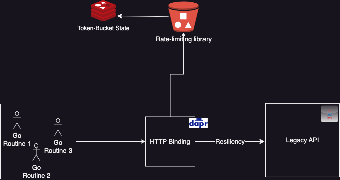

# Rate-limiting a DAPR HTTP Binding - Design proposal

## Introduction

DAPR has a convenient HTTP binding that allows you to invoke any REST endpoint from your application. This is useful for integrating with external services, such as Twilio, SendGrid, or any other service that exposes an HTTP API. However, legacy or enterprise services may have rate limits or budgets that have to be honored by the application calling the APIs. This sample shows how a DAPR application can to do that by extending an available rate-limiting library in Golang.

While this sample shows how to implement rate-limiting using DAPR State to store the distributed token bucket, this approach would have to be integrated into the DAPR runtime to be truly useful. Some design ideas are proposed in the conclusion.

## daprstore implementation

This existing rate-limiting library was extended to support distributed rate-limiting using DAPR state. This library was interesting because it allowed multiple stores to be implemented to store the token bucket that is used for the rate-limiting. Out-of-the-box, a memory store and a no-op store are implemented. Based on the memory store implementation, a DAPR state store was implemented. The DAPR state store is implemented in the [daprstore](../daprstore) directory.

The contents of the token bucket are preserved in DAPR state and if there are any server-side conflicts (due to eTag mismatch for example) they are resolved by retrying the operation until the bucket state is consistent. A mutex is used to manage in-process concurrency of the token bucket state to avoid multiple writes to the DAPR state store from the same process.

All of the existing test cases for the rate-limiting library (memorystore) were run against the DAPR state store implementation and they all passed.

## Running the tests and sample

To run the tests and sample, you need to have DAPR [installed and initialized](https://docs.dapr.io/getting-started/install-dapr-cli/). You also need to have a DAPR state store configured. The sample uses the Redis state store. It is also recommended that you use a Redis state store in production since the token bucket algorithm is heavy on read-write operations and Redis is very fast at this.

### Running the tests

The tests are located in the *daprstore* folder and can be executed as follows:

```bash
./runtest.sh
```

This will executed the same set of tests that were developed for the *memorystore* against the daprstore. The output of the tests will produce verbose results and eventually display a PASS message like this:

```bash
...
== APP == PASS
== APP == ok  	github.com/sethvargo/go-limiter/daprstore	2.157s
```

### Simple use-case

Execute the ./runsample.sh script to run the sample. The script will start the DAPR sidecar and then compile and run the main.go file. This sample will setup a token bucket of 1 token per second and attempt to take 50 tokens sequentially from the bucket. The rate-limiter will ensure that only 1 token is taken per second. The output of the sample will look like this:

```bash
ℹ️  Checking if Dapr sidecar is listening on GRPC port 62533
ℹ️  Dapr sidecar is up and running.
ℹ️  Updating metadata for appPID: 47668
ℹ️  Updating metadata for app command: go run .
✅  You're up and running! Both Dapr and your app logs will appear here.

== APP == dapr client initializing for: 127.0.0.1:62533
== APP == 0 1 0 1692018361842265000 true <nil>
== APP == 1 1 0 1692018362842265000 true <nil>
== APP == 2 1 0 1692018363842265000 true <nil>
== APP == 3 1 0 1692018364842265000 true <nil>
== APP == 4 1 0 1692018365842265000 true <nil>
== APP == 5 1 0 1692018366842265000 true <nil>
== APP == 6 1 0 1692018369842265000 true <nil>
== APP == 7 1 0 1692018376842265000 true <nil>
== APP == 8 1 0 1692018377842265000 true <nil>
== APP == 9 1 0 1692018378842265000 true <nil>
== APP == 10 1 0 1692018379842265000 true <nil>
== APP == 11 1 0 1692018381842265000 true <nil>
== APP == 12 1 0 1692018382842265000 true <nil>
== APP == 13 1 0 1692018383842265000 true <nil>
...
```
You will notice that the tokens are consumed at about 1 per second.

### Distributed use-case

Re-run the ./runsample.sh script in a terminal window and while it it is running, open another terminal window and run the ./runsample2.sh script. This will start another instance of the sample application. The sample application will now also attempt to take 50 tokens from the token bucket, but this time it will do so in co-ordination with the other instance. You will notice the outout of each terminal window is interleaved as the two instances of the sample application take turns taking tokens from the bucket. 

> Both applications must use the same DAPR *app-id* in order to share the same state.

> Noteworthy is that the two applications don't interleave exactly on a token-by-token basis. This is because the token bucket algorithm is not deterministic. It is possible that one application will take multiple tokens in a row before the other application gets a chance to take a token.

> Instead of a token-bucket algorithmm, a leaky-bucket algorithm could be used to ensure that the two applications take turns taking tokens from the bucket. This would be a good enhancement to the library.

## Integration with DAPR Runtime

### HTTP Binding 

Proposed binding configuration metadata changes would add the following configuration options to the HTTP binding:

- *maxCallsPerPeriod* - the maximum number of calls allowed per period
- *period* - the period of time in which the maximum number of calls is allowed
- *rateLimitStore* - the name of the DAPR state store to use for the rate-limiting

```yaml
apiVersion: dapr.io/v1alpha1
kind: Component
metadata:
  name: http-person-service
spec:
  type: bindings.http
  version: v1
  metadata:
    - name: url
      value: http://localhost:8089/participant
    - name: maxCallsPerPeriod
      value: "10"
    - name: period
      value: "1s"
    - name: rateLimitStore
      value: "redis-rate-limit"
```

The DAPR HTTP Binding implementation would have to be extended to call the rate-limiting library to check if there are enough tokens for the call and if not, wait for some period of time before attempting to get another token. One area of integration would be the [Invoke](https://github.com/dapr/components-contrib/blob/master/bindings/http/http.go#L222) method in the HTTP binding. 



### Service Bus Binding

The Azure Servive Bus binding in DAPR provides a fixed rate of messages per second (as defined by the [maxActiveMessages](https://v1-9.docs.dapr.io/reference/components-reference/supported-pubsub/setup-azure-servicebus/) setting). The rate-limiting library could be used to implement dynamic flow-control for the Service Bus binding. The Service Bus binding would have to be extended to call the rate-limiting library to check if there are enough tokens for the next message and if not, wait for some period of time before attempting to get another token. 

### Other Bindings

In a similar way, other bindings may benefit from the Token Bucket algorithm to the control flow of execution. Any of the Pub/Sub message brokers and bindings can be extended to use the Token Bucket algorithm to control the flow of messages, so if there is a common flow in the DAPR runtime that is used by all of the bindings, it would be better to implement the Token Bucket algorithm in that common flow.
